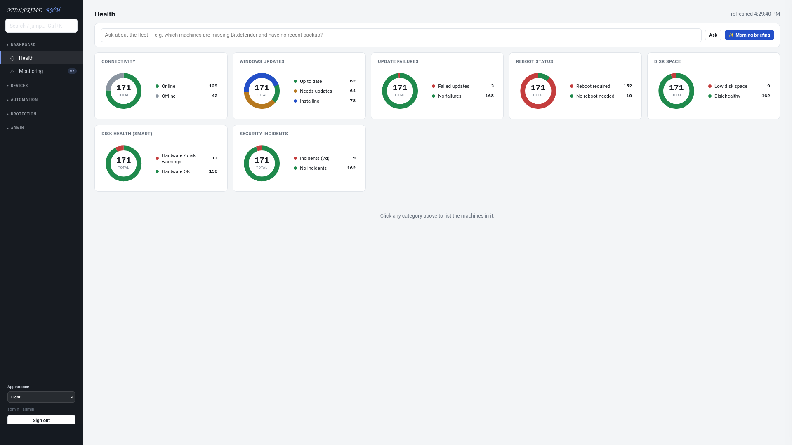
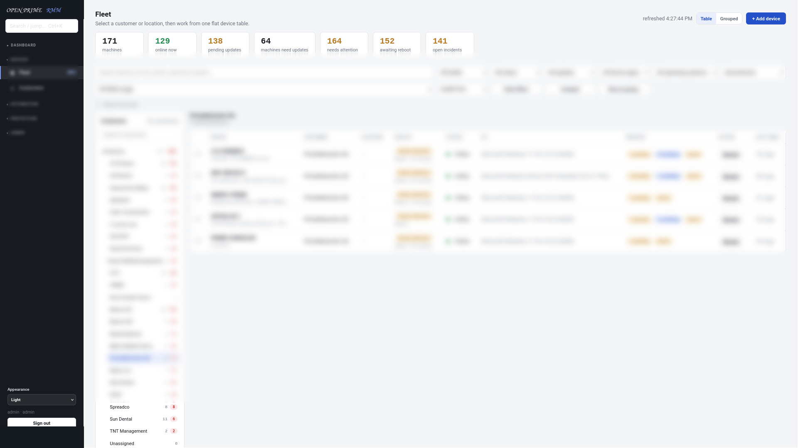
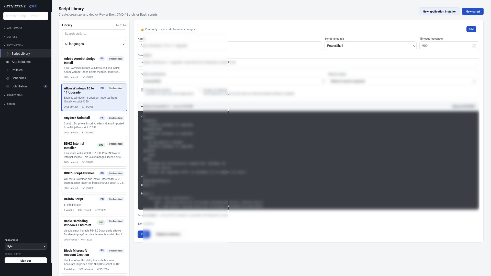
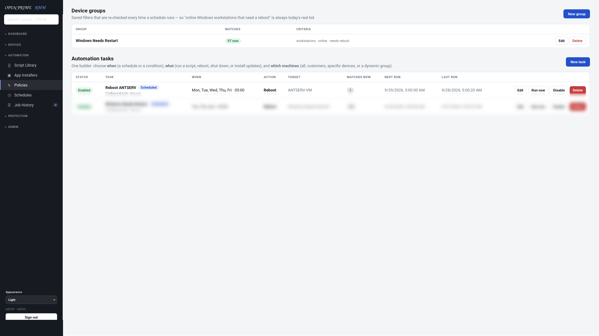
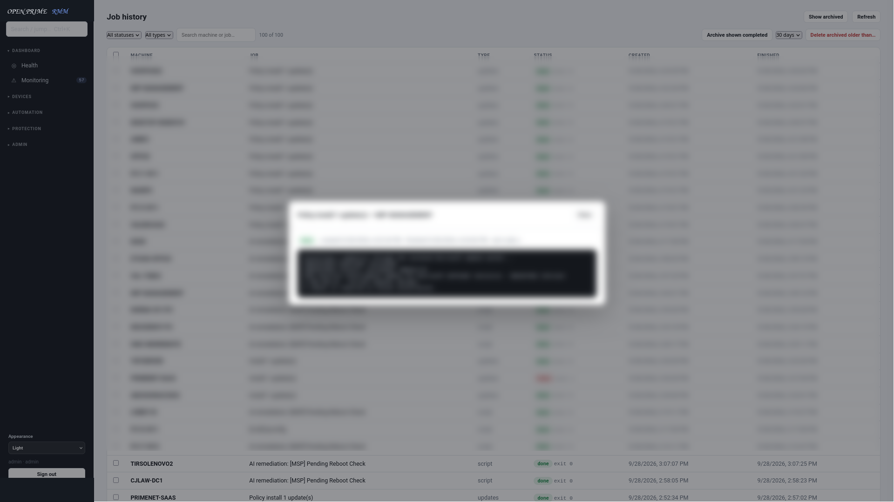

# OpenPrimeRMM

OpenPrimeRMM is a community-source, self-hosted RMM platform for MSPs and internal IT teams to monitor Windows endpoints, manage patches, run scripts, automate operations, and track fleet health.

This repository is the community-source, tenant-neutral distribution. It does not include private tenant seed scripts, credentials, production data, or deployment history.

## License model

OpenPrimeRMM is source-available, not OSI open source.

MSPs may self-host it internally to manage their own customers. Charging customers for general managed IT, cybersecurity, monitoring, patching, helpdesk, backup, or support services is allowed.

You may not sell OpenPrimeRMM itself as a per-seat, per-device, per-agent, hosted, sublicensed, white-labeled, or competing commercial RMM product without a separate commercial license.

See:

- LICENSE.md for the controlling license terms
- COMMERCIAL.md for a plain-English commercial-use summary
- TRADEMARKS.md for branding restrictions

## Quick install

Use a fresh Linux VM with systemd. Debian/Ubuntu are the primary target. Fedora and openSUSE are best-effort supported by the installer.

```bash
sudo bash install.sh
```

The installer asks for:

- public DNS name, or blank for LAN-only testing
- internal application port
- display/company name
- whether to install/configure Caddy for HTTPS
  - with a public DNS name, Caddy requests a public Let's Encrypt certificate
  - without a public DNS name, Caddy can create local LAN HTTPS using its internal certificate authority
  - if you decline Caddy, the installer can expose plain LAN HTTP for lab-only testing
- whether to keep or rotate existing secrets on reinstall

It installs Python dependencies, creates `/opt/open-prime-rmm`, creates a dedicated service user, writes a systemd auto-start service, optionally configures Caddy HTTPS, and generates unique per-instance secrets in `/etc/open-prime-rmm.env`:

- dashboard admin password
- enrollment key
- session secret
- read-only API token
- public dashboard URL
- cookie security mode

Do not commit or share `/etc/open-prime-rmm.env`.

For public production access, use a DNS name and Caddy/Let's Encrypt. LAN-local HTTPS uses Caddy's internal CA, so browsers may warn until you trust the generated Caddy root certificate on the client device.

## Agent install

After install, the script prints a PowerShell command for your first Windows agent. Run it as Administrator on a test Windows machine.

Already-enrolled agents use their own per-machine token. Rotating the enrollment key affects only new enrollments.

## Screenshots

The screenshots below show the dashboard layout with identifying endpoint/customer data blurred.











## Security notes

This system can execute scripts as SYSTEM on managed endpoints. Treat the server like critical infrastructure.

Built-in protections include per-endpoint agent tokens, server-side token hashing, authenticated agent check-ins, tenant-safe enrollment collision checks, locked-down endpoint config ACLs, no inbound listener on endpoints, dashboard password hashing, optional TOTP 2FA, login throttling, role checks, generated per-instance server secrets, and a hardened systemd service.

Recommended before real use:

- run behind HTTPS only
- restrict dashboard access by VPN/IP allowlist if possible
- enable 2FA for dashboard users
- back up `/opt/open-prime-rmm/server/data` and `/etc/open-prime-rmm.env`
- pilot agent changes on a lab workstation before broad rollout
- rotate the enrollment key after mass enrollment

See SECURITY.md for the full security model, current controls, known limitations, reporting process, and hardening roadmap.

## Development

```bash
python3 -m venv .venv
. .venv/bin/activate
pip install -r requirements-dev.txt
bash -n install.sh backup-now.sh restore-backup.sh
python -m compileall -q server agent
OUTPOST_ADMIN_PASSWORD=test OUTPOST_ENROLL_KEY=test python -m pytest -q
```

To run locally:

```bash
export OUTPOST_ADMIN_PASSWORD=dev-password
export OUTPOST_ENROLL_KEY=dev-enroll-key
cd server
uvicorn app:app --host 127.0.0.1 --port 8420
```

Open http://127.0.0.1:8420.
